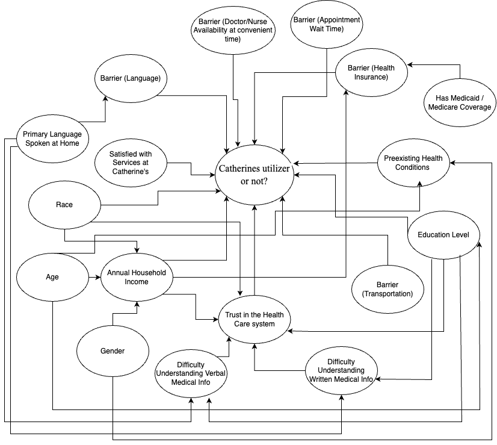

```{r}
#| label: setup
#| include: false

library(tidyverse)
library(mosaic)
library(glmmTMB)
library(DHARMa)
library(s245)
library(ggeffects)
library(car)
```

# Introduction

Our project partner is Streams, a Christian non-profit organization based in Grand Rapids, MI. Streams serves as a neighborhood hub for the Townline neighborhood, providing essential services such as healthcare through Catherine’s Health Center, food distribution, tutoring, and playgroups. Their mission is to bridge health disparities and improve the well-being of the diverse and underserved populations in the neighborhood.

The DW2202 Streams Nursing Neighborhood Health Survey was conducted by Calvin University nursing students and Streams volunteers to assess the health care needs of residents in the Townline neighborhood. The data were collected through in-person surveys, either on paper or electronically, with respondents providing self-reported information about their healthcare access, barriers to care, mental health, oral health, housing stability, and demographic characteristics, etc. The survey aims to inform healthcare planning and resource allocation efforts by Catherine’s Health Center at Streams.

# Descriptive Table


# Modeling

```{r}
health_survey_df <- read_csv(
  "https://github.com/nghtctrl/proj-streams/raw/refs/heads/main/clean_health_survey_data.csv",
  show_col_types = FALSE
)
```

## Model Planning

### Causal Diagram

```{mermaid}
flowchart LR
  A(Catherine’s utilizer?)
  B(Satisfied with services at Catherine’s?)
  C(Race)
  D(Age)
  E(Annual household income)
  F(Gender)
  G(Difficulty understanding verbal medical information)
  H(Trust in the healthcare system)
  I(Difficulty understanding written medical information)
  J(Lack of transportation?)
  K(Education level)
  L(Preexisting health conditions)
  M(Lack of health insurance?)
  N(Has medicaid or medicar)
```



### Checklist

## Data Exploration

```{r}
gf_boxplot(
  received_services_at_catherines ~ age,
  data = health_survey_df
)
```

## Model Fitting

```{r}
health_survey_df <- health_survey_df |>
  mutate(received_services_at_catherines = factor(received_services_at_catherines))
```

```{r}
health_survey_model <- glmmTMB(
  received_services_at_catherines ~ age,
  data = health_survey_df,
  family = binomial(link = "logit")
)
```

```{r}
summary(health_survey_model)
```

## Model Assessment

### DHARMa Residuals vs. Fitted Plot

```{r}
health_survey_model_sim <- simulateResiduals(health_survey_model)
plotResiduals(health_survey_model)
```

### ACF Plot

```{r}
s245::gf_acf(~health_survey_model) |> gf_lims(y = c(-1, 1))
```

## Prediction Plot

```{r}
ggpredict(health_survey_model, terms = c("age")) |> plot()
```

## Making Inference

```{r}
car::Anova(health_survey_model)
```

## Interpretation

## Conclusion

# Appendix
