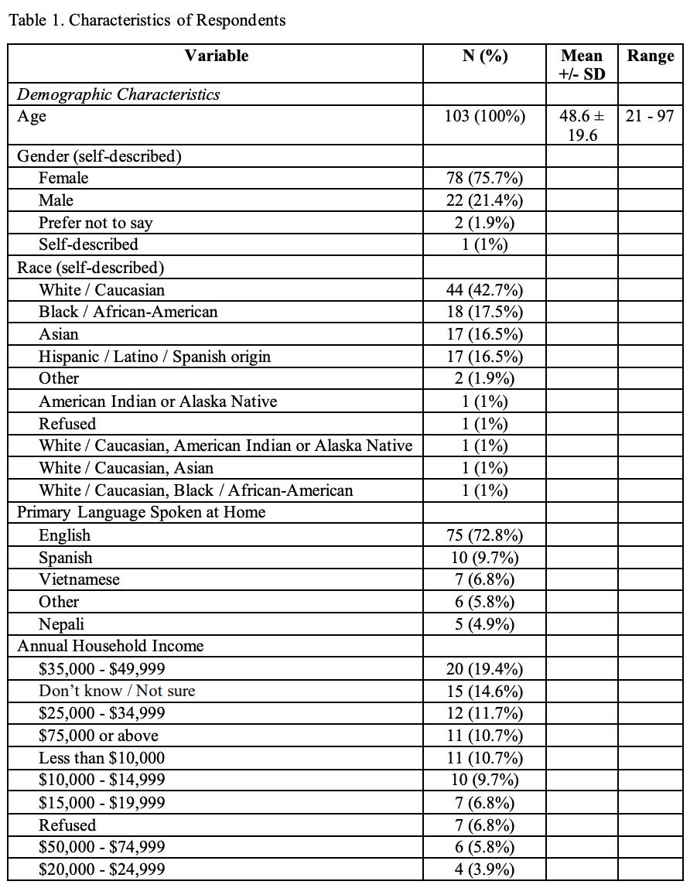
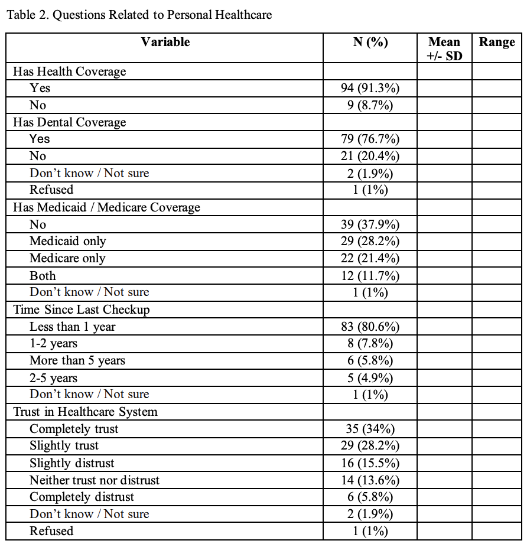
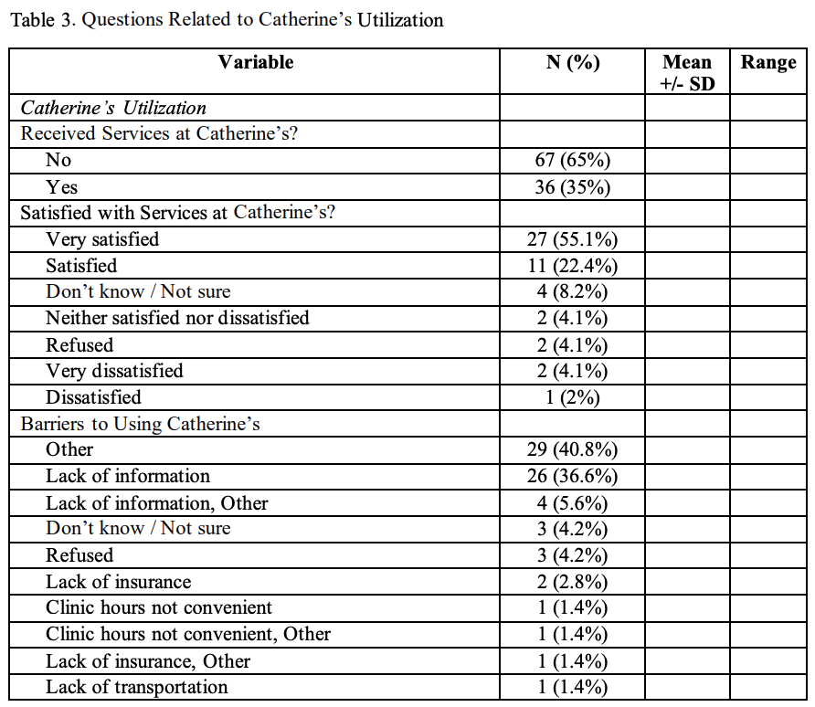

```{r}
#| label: setup
#| include: false

library(tidyverse)
library(mosaic)
library(glmmTMB)
library(DHARMa)
library(s245)
library(ggeffects)
library(car)
```

```{r}
#| include: false

health_survey_df <- read_csv(
  "https://github.com/nghtctrl/proj-streams/raw/refs/heads/main/clean_health_survey_data.csv",
  show_col_types = FALSE
)
```

# Introduction

This technical report presents an initial visualization and analysis of data collected through the DW2202 Streams Nursing Neighborhood Health Survey, a collaborative initiative between Calvin University nursing students and [Streams](https://streamsgr.org/), a Christian non-profit organization based in Grand Rapids, Michigan. Streams offer a range of essential services to the Southeast Grand Rapids neighborhood, including healthcare in partnership with [Catherine's Health Center](https://catherineshc.org/). Streams' mission is to bridge health disparities and improve the well-being of the diverse and underserved populations in the neighborhood.

The primary objective of the survey was to evaluate the healthcare needs of Southeast Grand Rapids residents by gathering self-reported data across several domains, including access to healthcare, barriers to healthcare services, physical health, annual household income, and key demographic indicators. Administered in person by nursing students, the survey was conducted in both paper and electronic formats. The purpose of this technical report is to present an initial visualization and analysis of the collected data and to support strategic healthcare planning and resource allocation by Catherine's Health Center, with the goal of fostering a more accessible healthcare environment within the Southeast Grand Rapids neighborhood.

# Descriptive Table

To provide an initial visualization of the self-reported survey data, we created sets of descriptive tables showing the basic statistics (i.e., percentage of respondents, mean, standard deviation, and range) for the relevant variables.

The descriptive tables were manually constructed using the outputs from @sec-appendix-c. To produce these tables, we first cleaned and prepared the survey data. For more details on the data cleaning and preparation process, please refer to @sec-appendix-b.







# Data Exploration

Based on the descriptive table, we were particularly curious about *who* uses Catherine's services. One factor we believed to be relevant was the survey respondents' annual household income.

```{r}
gf_bar(~received_services_at_catherines, fill = ~income_category,
       data = subset(health_survey_df, !is.na(income_category) & 
                     !is.na(received_services_at_catherines)), 
       position = "dodge") +
  labs(
    title = "People Who Are More Affluent Tend Not to Use Catherine's Services.",
    x = "Income", 
    y = "Count"
  ) +
  scale_fill_discrete(name = "Income Category") +
  theme_minimal()
```

Based on this plot, we can see that more affluent respondents (i.e., those within the $25,000 to $49,999 range) tend not to use Catherine's services. To further explore whether there is an association between annual household income and the use of Catherine's services, we initially planned to build a model. However, due to limitations in sample size, we decided to examine another factor instead: age.

```{r}
gf_boxplot(
  received_services_at_catherines ~ age, 
  data = health_survey_df
) |> gf_labs(
  title = "Older People Receive More Services at Catherine's",
  x = "Age",
  y = "Received Services at Catherine's"
)
```

This plot reveals a noticeable difference in median age between those who do and do not receive services at Catherine's, with recipients tending to be older. However, the graph also shows a wide age range among those who receive services, which suggests that Catherine's caters to a diverse age group and not *just* older individuals.

# Modeling

Hence, we pose a research question: Is age associated with whether a person receives services at Catherine's?

## Model Planning

To help plan our model, we first drew a causal diagram of the variables that we believed were relevant:

### Causal Diagram

```{mermaid}
flowchart LR
  A(Age)
  B(Race)
  C(Gender)
  D("Annual Household Income")
  E("Has Medicaid / Medicare Coverage")
  F("Has Health Coverage")
  G("Primary Language Spoken at Home")
  H("Barriers to Using Catherine's")
  I("Received Services at Catherine's?")
  J("Satisfied with Services at Catherine's?")
  J --> I
  A --> I
  H --> I
  D --> I
  F --> I
  G --> H
  A --> D
  A --> F
  B --> D
  B --> F
  B --> E
  C --> D
  C --> E
  C --> F
```

### Checklist

Based on the causal diagram, we went through the [model planning checklist](https://stacyderuiter.github.io/stat245-sp25/model-plan-checklist.pdf) to assess whether there are potential confounders, colliders, etc., to help us justify model planning choices:

Response and key predictor variables:

- Response variable: `Received Services at Catherine's?`.
- Key predictor variable: `Age` (has 1 parameter).

There are no confounders that we are aware of.

There are no colliders that we are aware of.

There are no moderators that we are aware of.

Precision covariates:

- `Satisfied with Services at Catherine's?` (has `r length(unique(health_survey_df$satisfaction_with_catherines))` parameters)
- `Barriers to Using Catherine's` (has `r length(unique(health_survey_df$barriers_to_using_catherines))` parameters)

Mediation chains:

- `Age` -> `Has Health Coverage` -> `Received Services at Catherine's?` (`Has Health Coverage` has `r length(unique(health_survey_df$health_coverage))` parameters)
- `Age` -> `Annual Household Income` -> `Received Services at Catherine's?` (`Annual Household Income` has `r length(unique(health_survey_df$income_category))` parameters)

```{r}
#| include: false

approval_counts <- table(health_survey_df$received_services_at_catherines)
approved_count <- approval_counts["Yes"]
denied_count <- approval_counts["No"]
m <- min(approved_count, denied_count)
```

The `Received Services at Catherine's?` variable contains `r approved_count` successes and `r denied_count` failures such that $m = \text{min(successes, failures)} = `r m`$. A common rule of thumb suggests that the maximum number of parameters $p$ should be less than or equal to $\frac{m}{15}$, which in this case is $p \leq \frac{`r m`}{15} \approx `r round(m / 15, 0)`$. This means that we may have up to `r round(m / 15, 0)` parameters.

Based on this rule of thumb, we will not be able to include any precision covariates, since including them would violate the rule of thumb. Since all the mediation chains we have identified branch out, we will choose `Age` for all of them in the interest of measuring the total effect. This means that our total parameter count is 1, which is less than `r round(m / 15, 0)`. Therefore, we will not be violating the $p < \frac{m}{15}$ rule of thumb.

## Model Fitting

We fitted a binomial model with logit link function because our response variable (i.e., `Received Services at Catherine's?`) is binary.

```{r}
health_survey_df <- health_survey_df |>
  mutate(
    received_services_at_catherines = factor(
      received_services_at_catherines
    )
  )

health_survey_model <- glmmTMB(
  received_services_at_catherines ~ age,
  data = health_survey_df,
  family = binomial(link = "logit")
)

summary(health_survey_model)
```

## Model Assessment

To ensure that our model can provide valid conclusion, we assessed whether it meets the assumptions of binomial model. Specifically, we assessed: (1) logit-linearity, (2) the mean-variance relationship, and (3) independence of residuals.

### DHARMa Residuals vs. Fitted Plot

```{r}
health_survey_model_sim <- simulateResiduals(health_survey_model)
plotResiduals(health_survey_model)
```

This plot assesses (1) logit-linearity and (2) the mean-variance relationship. There is no apparent trend in the quantile lines, and the spread of the residuals is generally uniform, with no noticeable clustering. This suggests that the relationship between residuals and predicted values is logit-linear, and that the variance is approximately constant (i.e., variance ≈ mean). Therefore, conditions (1) and (2) are satisfied.

### ACF Plot

```{r}
s245::gf_acf(~health_survey_model) |> gf_lims(y = c(-1, 1))
```

This plot assesses the independence of residuals. At $\text{Lag} = 0$, the $\text{ACF} = 1$; however, at all other $\text{Lag}$s, the $\text{ACF}$ values are generally inside the "fence" of the confidence bounds. Therefore, the condition is satisfied.

### Overall Assessment

Since all the conditions are satisfied, we can continue and draw a conclusion using our model.

## Prediction Plot

```{r}
ggpredict(health_survey_model, terms = "age [all]") |> plot()
```

This plot shows that the predicted probability of receiving services at Catherine's increases with age. The shaded region represents the confidence interval, indicating greater uncertainty in predictions at both extremes of the age range.

## Making Inference

### Confidence Interval Estimate

```{r}
confint(health_survey_model)
```

### ANOVA Table

```{r}
car::Anova(health_survey_model)
```

## Interpretation

Since our model passed the model assessment, our model can be used to draw a valid conclusion. Our prediction plot shows that `Age` is positively associated with `Received Services at Catherine's?`. Our ANOVA table complements this result, showing strong evidence (p = 0.0015) that `Age` is a predictor of receiving services at Catherine's. The confidence interval estimate suggests that for each additional year in Age, the expected probability of receiving services at Catherine's increase by approximately 0.0358 (95% CI: 0.0138 to 0.0578).

## Conclusion

Therefore, our analysis provides strong evidence that age is positively associated with receiving services at Catherine's. Specifically, as age increases, the probability of receiving services also increases.

However, we note a limitation in our conclusion: we did not include precision covariates due to restrictions on the number of parameters in our model. A larger sample size would be required to draw a more robust conclusion.

# Appendix A {#sec-appendix-a}

This is a data dictionary that we developed based on looking at the [original raw data](https://github.com/nghtctrl/proj-streams/blob/main/health_survey_data.csv). It was used to guide the data cleaning and preparation as shown on @sec-appendix-b.

| Variable Name | Description | Units | Possible Values | Notes |
| :---: | :---: | :---: | :---: | :---: |
| `QID6` | Usual place for health care | N/A | 1 = Yes, 2 = No, 3 = More than one place, 4 = Don’t know / Not sure, 5 = Refused | |
| `QID7` | Type of healthcare facility for usual health care | N/A | 1 = Clinic or health center, 2 = Doctor’s office or HMO, 3 = Hospital ER, 4 = Urgent care / walk-in clinic, 5 = Some other place, 6 = Don’t know, 7 = Refused | |
| `QID8` | Awareness of clinics/resources (multiple selections possible) | N/A | 1 = Clinica Santa Maria, 3 = Cherry Street Clinic, 4 = Exalta Health, 5 = Catherine’s Health Center, 6 = None of these, 7 = Corewell Urgent Care | Some concerns about the ordering of the choices |
| `QID9` | Number of ER visits in past year | Count | Integer values | |
| `QID12` | Time since last routine checkup | N/A | 1 = $0 <= x < 1$ years, $2 = 1 <= x < 2$ years, 3 = $2 <= x < 5$ years, 4 = $x > 5$ years, 5 = Never, 6 = Don’t know / Not sure, 7 = Refused | |
| `QID89BH_1` | Whether the respondent or someone in their household has been diagnosed with asthma | N/A | 1 = Respondent, 2 = No one, 3 = Don’t know/refused, 4 = Household member | |
| `QID89BH_2` | Whether the respondent or someone in their household has been diagnosed with high blood pressure | N/A | Same as above | |
| `QID89BH_3` | Whether the respondent or someone in their household has been diagnosed as overweight | N/A | Same as above | |
| `QID89BH_4` | Whether the respondent or someone in their household has been diagnosed with depression | N/A | Same as above | |
| `QID89BH_5` | Whether the respondent or someone in their household has been diagnosed with an anxiety disorder | N/A | Same as above | |
| `QID89BH_6` | Whether the respondent or someone in their household has been diagnosed with diabetes | N/A | Same as above | |
| `Q16_1` | Lack of health insurance as a barrier to receiving needed health care | N/A | 1 = Agree or true, 2 = Neutral or not sure, 3 = Disagree or not true | |
| `Q16_4` | Language barriers preventing access to health care | N/A | Same as above | |
| `Q16_6` | Availability of transportation to health care | N/A | Same as above | |
| `Q16_7` | Availability of doctors or nurses at convenient times | N/A | Same as above | |
| `Q16_9` | Delayed health care due to appointment wait times | N/A | Same as above | |
| `QID20` | Health coverage status | N/A | 1 = Yes, 2 = No, 3 = Don’t know / Not sure, 4 = Refused | |
| `QID21` | Medicaid/Medicare coverage | N/A | 1 = Medicaid only, 2 = Medicare only, 3 = Both, 4 = No, 5 = Don’t know / Not sure, 6 = Refused | |
| `QID22` | Whether the respondent needed to see a doctor in the past 12 months but could not due to cost | N/A | 1 = Yes, 2 = No, 3 = Don’t know / Not sure, 4 = Refused | |
| `QID26` | Prescription medication affordability | N/A | 1 = Yes, 2 = No, 3 = Don’t know / Not sure, 4 = Refused | |
| `QID200` | Trust in healthcare system | N/A | 1 = Completely trust, 2 = Slightly trust, 3 = Neither trust nor distrust, 4 = Slightly distrust, 5 = Completely distrust, 6 = Don’t know / Not sure, 7 = Refused | |
| `QID201` | Frequency of problems understanding medical condition due to difficulty reading written information from health providers | N/A | 1 = Always, 2 = Often, 3 = Sometimes, 4 = Occasionally, 5 = Never, 6 = Don’t know / Not sure, 7 = Refused | |
| `QID202` | Frequency of problems understanding verbal medical information from health providers | N/A | Same as above | |
| `QID29` | Time since last dental visit (includes all types of dentists) | N/A | 1 = $0 <= x < 1$ years, $2 = 1 <= x < 2$ years, 3 = $2 <= x < 5$ years, 4 = $x > 5$ years, 5 = Never, 6 = Don’t know / Not sure, 7 = Refused | |
| `QID30` | Whether respondent has any dental insurance coverage | N/A | 1 = Yes, 2 = No, 3 = Don’t know / Not sure, 4 = Refused | Is dental insurance under the umbrella of health coverage, or are they considered different? Otherwise, potential discrepancy. |
| `QID31` | Whether respondent has forgone dental care in the past year due to cost | N/A | Same as above | |
| `QID204` | Whether the respondent feels that children in their neighborhood have access to safe spaces to play and be physically active after school (3-6 PM) | N/A | 1 = Yes, 2 = No, 3 = Don’t know / Not sure, 4 = Refused | |
| `QID208` | Housing insecurity (e.g., inability to pay rent/utilities) | N/A | 1 = Yes, 2 = No, 3 = Don’t know / Not sure, 4 = Refused | |
| `Q34_1` | Frequency of feeling nervous, anxious, or on edge in the past two weeks | N/A | 1 = Not at all, 2 = Several days, 3 = More than half the days, 4 = Nearly every day, 6 = Don’t know / Not sure, 7 = Refused | |
| `Q34_2` | Frequency of being unable to stop or control worrying in the past two weeks | N/A | Same as above | |
| `Q34_3` | Frequency of feeling little interest or pleasure in doing things in the past two weeks | N/A | Same as above | |
| `Q34_4` | Frequency of feeling down, depressed, or hopeless in the past two weeks | N/A | Same as above | |
| `QID44` | Primary language spoken | N/A | 1 = English, 2 = Spanish, 6 = Nepali, 7 = Vietnamese, 3 = Other, 4 = Don’t know / Not sure, 5 = Refused | |
| `QID44_3_TEXT` | Primary language spoken (other) | Text | User input | |
| `QID45` | Home ownership status | N/A | 1 = Own, 2 = Rent, 3 = Don’t know / Not sure, 4 = Refused | |
| `Q41` | Highest education level | N/A | 1 = Less than 6th grade, 11 = 6th-8th grade, 8 = 9th-11th grade, 2 = High school diploma / GED, 4 = Some college, 5 = Associate or technical degree, 6 = Bachelor's degree, 7 = Master's degree or higher, 9 = Don't know / Not sure, 10 = Refused | |
| `QID46` | Age | Years | Integer values | |
| `QID47` | Race/Ethnicity (multiple selections possible) | N/A | 1 = White / Caucasian, 2 = Black / African-American, 3 = Hispanic / Latino / Spanish origin, 4 = American Indian or Alaska Native, 5 = Asian, 6 = Native Hawaiian / Pacific Islander, 7 = Other, 9 = Don't know / Not sure, 8 = Refused | |
| `QID47_7_TEXT` | Race/Ethnicity (other) | Text | User input | |
| `QID49` | Annual household income | N/A | 1 = Less than \$10,000, 2 = \$10,000 to \$14,999, 3 = \$15,000 to \$19,999, 4 = \$20,000 to \$24,999, 5 = \$25,000 to \$34,999, 6 = \$35,000 to \$49,999, 7 = \$50,000 to \$74,999, 10 = \$75,000 or above, 8 = Don't know / Not sure, 9 = Refused | |
| `QID91` | Gender identity | N/A | 1 = Male, 2 = Female, 3 = Non-binary, 4 = Self-described, 5 = Prefer not to say | |
| `QID91_4_TEXT` | Gender identity (self-described) | Text | User input | |
| `Q107` | Whether the respondent has received services at Catherine’s Health Center at Streams | N/A | 1 = Yes, 2 = No, 3 = Don’t know / Not sure, 4 = Refused | |
| `Q108` | Satisfaction with experience at Catherine’s Health Center | N/A | 1 = Very satisfied, 2 = Satisfied, 3 = Neither satisfied nor dissatisfied, 4 = Dissatisfied, 5 = Very dissatisfied, 6 = Don’t know / Not sure, 7 = Refused | |
| `Q109` | Barriers preventing respondent from utilizing Catherine’s Health Center (multiple selections possible) | N/A | 1 = Lack of information, 2 = Lack of insurance, 3 = Lack of transportation, 4 = Long appointment wait times, 5 = Clinic hours not convenient, 6 = Other, 7 = Don’t know / Not sure, 8 = Refused | |
| `Q109_6_TEXT` | Barriers preventing respondent from utilizing Catherine’s Health Center (other) | Text | User input | |
| `Q110` | Whether the respondent lives in zip code 49548 | N/A | 1 = Yes, 2 = No, 3 = Don’t know / Not sure, 4 = Refused | |
| `QID52` | Interest in coming back for survey | N/A | 1 = Yes, 2 = No, 3 = Don’t know / Not sure, 4 = Refused | This is probably not useful for analysis |
| `QID212` | Interviewer’s notes or observations about the interview | Text | Interviewer response | Same as above |
| `Paper` | Indicates whether the survey was completed on paper | N/A | Yes or N/A | Are there significant difference between electronic/paper versions that we should be worried? |

# Appendix B {#sec-appendix-b}

```{r}
# Load the dataset
health_survey_df <- read_csv(
  "https://github.com/nghtctrl/proj-streams/raw/refs/heads/main/health_survey_data.csv",
  show_col_types = FALSE
)

# Exclude both the first and last row
health_survey_df <- health_survey_df[-c(1, nrow(health_survey_df)), ]

glimpse(health_survey_df)
```

To clean and prepare our dataset for visualization and modeling purposes, we will transform the columns and values into more human-readable format. Some columns have values with multiple answers (i.e., survey respondents were able to select multiple answers to a question). For these columns, further data wrangling process may be necessary.

The column names were renamed using the data dictionary that we developed on @sec-appendix-A.

```{r}
health_survey_df <- health_survey_df |>
  transmute(
    usual_place_healthcare = case_when(
      QID6 == "1" ~ "Yes",
      QID6 == "2" ~ "No",
      QID6 == "3" ~ "More than one place",
      QID6 == "4" ~ "Don’t know / Not sure",
      QID6 == "5" ~ "Refused"
    ),
    healthcare_facility_type = case_when(
      QID7 == "1" ~ "Clinic or health center",
      QID7 == "2" ~ "Doctor’s office or HMO",
      QID7 == "3" ~ "Hospital ER",
      QID7 == "4" ~ "Urgent care / walk-in clinic",
      QID7 == "5" ~ "Some other place",
      QID7 == "6" ~ "Don’t know",
      QID7 == "7" ~ "Refused"
    ),
    awareness_of_clinics = str_replace_all(QID8, c(
      "1" = "Clinica Santa Maria",
      "3" = "Cherry Street Clinic",
      "4" = "Exalta Health",
      "5" = "Catherine’s Health Center",
      "6" = "None of these",
      "7" = "Corewell Urgent Care"
    )),
    num_ER_visits_past_year = QID9,
    time_since_last_checkup = case_when(
      QID12 == "1" ~ "Less than 1 year",
      QID12 == "2" ~ "1-2 years",
      QID12 == "3" ~ "2-5 years",
      QID12 == "4" ~ "More than 5 years",
      QID12 == "5" ~ "Never",
      QID12 == "6" ~ "Don’t know / Not sure",
      QID12 == "7" ~ "Refused"
    ),
    asthma_in_household = str_replace_all(QID89BH_1, c(
      "1" = "Respondent",
      "2" = "No one",
      "3" = "Don’t know / Refused",
      "4" = "Household member"
    )),
    high_bp_in_household = str_replace_all(QID89BH_2, c(
      "1" = "Respondent",
      "2" = "No one",
      "3" = "Don’t know / Refused",
      "4" = "Household member"
    )),
    overweight_in_household = str_replace_all(QID89BH_3, c(
      "1" = "Respondent",
      "2" = "No one",
      "3" = "Don’t know / Refused",
      "4" = "Household member"
    )),
    depression_in_household = str_replace_all(QID89BH_4, c(
      "1" = "Respondent",
      "2" = "No one",
      "3" = "Don’t know / Refused",
      "4" = "Household member"
    )),
    anxiety_in_household = str_replace_all(QID89BH_5, c(
      "1" = "Respondent",
      "2" = "No one",
      "3" = "Don’t know / Refused",
      "4" = "Household member"
    )),
    diabetes_in_household = str_replace_all(QID89BH_6, c(
      "1" = "Respondent",
      "2" = "No one",
      "3" = "Don’t know / Refused",
      "4" = "Household member"
    )),
    health_insurance_barrier = case_when(
      Q16_1 == "1" ~ "Agree",
      Q16_1 == "2" ~ "Neutral",
      Q16_1 == "3" ~ "Disagree"
    ),
    language_barrier = case_when(
      Q16_4 == "1" ~ "Agree",
      Q16_4 == "2" ~ "Neutral",
      Q16_4 == "3" ~ "Disagree"
    ),
    transportation_availability = case_when(
      Q16_6 == "1" ~ "Agree",
      Q16_6 == "2" ~ "Neutral",
      Q16_6 == "3" ~ "Disagree"
    ),
    doctor_availability = case_when(
      Q16_7 == "1" ~ "Agree",
      Q16_7 == "2" ~ "Neutral",
      Q16_7 == "3" ~ "Disagree"
    ),
    wait_time_barrier = case_when(
      Q16_9 == "1" ~ "Agree",
      Q16_9 == "2" ~ "Neutral",
      Q16_9 == "3" ~ "Disagree"
    ),
    health_coverage = case_when(
      QID20 == "1" ~ "Yes",
      QID20 == "2" ~ "No",
      QID20 == "3" ~ "Don’t know / Not sure",
      QID20 == "4" ~ "Refused"
    ),
    medicaid_medicare_coverage = case_when(
      QID21 == "1" ~ "Medicaid only",
      QID21 == "2" ~ "Medicare only",
      QID21 == "3" ~ "Both",
      QID21 == "4" ~ "No",
      QID21 == "5" ~ "Don’t know / Not sure",
      QID21 == "6" ~ "Refused"
    ),
    needed_doctor_but_could_not_due_to_cost = case_when(
      QID22 == "1" ~ "Yes",
      QID22 == "2" ~ "No",
      QID22 == "3" ~ "Don’t know / Not sure",
      QID22 == "4" ~ "Refused"
    ),
    prescription_medication_affordability = case_when(
      QID26 == "1" ~ "Yes",
      QID26 == "2" ~ "No",
      QID26 == "3" ~ "Don’t know / Not sure",
      QID26 == "4" ~ "Refused"
    ),
    trust_in_healthcare_system = case_when(
      QID200 == "1" ~ "Completely trust",
      QID200 == "2" ~ "Slightly trust",
      QID200 == "3" ~ "Neither trust nor distrust",
      QID200 == "4" ~ "Slightly distrust",
      QID200 == "5" ~ "Completely distrust",
      QID200 == "6" ~ "Don’t know / Not sure",
      QID200 == "7" ~ "Refused"
    ),
    difficulty_understanding_written_medical_info = case_when(
      QID201 == "1" ~ "Always",
      QID201 == "2" ~ "Often",
      QID201 == "3" ~ "Sometimes",
      QID201 == "4" ~ "Occasionally",
      QID201 == "5" ~ "Never",
      QID201 == "6" ~ "Don’t know / Not sure",
      QID201 == "7" ~ "Refused"
    ),
    difficulty_understanding_verbal_medical_info = case_when(
      QID202 == "1" ~ "Always",
      QID202 == "2" ~ "Often",
      QID202 == "3" ~ "Sometimes",
      QID202 == "4" ~ "Occasionally",
      QID202 == "5" ~ "Never",
      QID202 == "6" ~ "Don’t know / Not sure",
      QID202 == "7" ~ "Refused"
    ),
    time_since_last_dental_visit = case_when(
      QID29 == "1" ~ "Less than 1 year",
      QID29 == "2" ~ "1-2 years",
      QID29 == "3" ~ "2-5 years",
      QID29 == "4" ~ "More than 5 years",
      QID29 == "5" ~ "Never",
      QID29 == "6" ~ "Don’t know / Not sure",
      QID29 == "7" ~ "Refused"
    ),
    dental_insurance_coverage = case_when(
      QID30 == "1" ~ "Yes",
      QID30 == "2" ~ "No",
      QID30 == "3" ~ "Don’t know / Not sure",
      QID30 == "4" ~ "Refused"
    ),
    forgone_dental_care_due_to_cost = case_when(
      QID31 == "1" ~ "Yes",
      QID31 == "2" ~ "No",
      QID31 == "3" ~ "Don’t know / Not sure",
      QID31 == "4" ~ "Refused"
    ),
    safe_spaces_for_children_after_school = case_when(
      QID204 == "1" ~ "Yes",
      QID204 == "2" ~ "No",
      QID204 == "3" ~ "Don’t know / Not sure",
      QID204 == "4" ~ "Refused"
    ),
    housing_insecurity = case_when(
      QID208 == "1" ~ "Yes",
      QID208 == "2" ~ "No",
      QID208 == "3" ~ "Don’t know / Not sure",
      QID208 == "4" ~ "Refused"
    ),
    feeling_nervous_anxious = case_when(
      Q34_1 == "1" ~ "Not at all",
      Q34_1 == "2" ~ "Several days",
      Q34_1 == "3" ~ "More than half the days",
      Q34_1 == "4" ~ "Nearly every day",
      Q34_1 == "6" ~ "Don’t know / Not sure",
      Q34_1 == "7" ~ "Refused"
    ),
    unable_to_control_worrying = case_when(
      Q34_2 == "1" ~ "Not at all",
      Q34_2 == "2" ~ "Several days",
      Q34_2 == "3" ~ "More than half the days",
      Q34_2 == "4" ~ "Nearly every day",
      Q34_2 == "6" ~ "Don’t know / Not sure",
      Q34_2 == "7" ~ "Refused"
    ),
    lack_interest_pleasure = case_when(
      Q34_3 == "1" ~ "Not at all",
      Q34_3 == "2" ~ "Several days",
      Q34_3 == "3" ~ "More than half the days",
      Q34_3 == "4" ~ "Nearly every day",
      Q34_3 == "6" ~ "Don’t know / Not sure",
      Q34_3 == "7" ~ "Refused"
    ),
    feeling_down_depressed = case_when(
      Q34_4 == "1" ~ "Not at all",
      Q34_4 == "2" ~ "Several days",
      Q34_4 == "3" ~ "More than half the days",
      Q34_4 == "4" ~ "Nearly every day",
      Q34_4 == "6" ~ "Don’t know / Not sure",
      Q34_4 == "7" ~ "Refused"
    ),
    primary_language_spoken = case_when(
      QID44 == "1" ~ "English",
      QID44 == "2" ~ "Spanish",
      QID44 == "6" ~ "Nepali",
      QID44 == "7" ~ "Vietnamese",
      QID44 == "3" ~ "Other",
      QID44 == "4" ~ "Don’t know / Not sure",
      QID44 == "5" ~ "Refused"
    ),
    home_ownership_status = case_when(
      QID45 == "1" ~ "Own",
      QID45 == "2" ~ "Rent",
      QID45 == "3" ~ "Don’t know / Not sure",
      QID45 == "4" ~ "Refused"
    ),
    highest_education_level = case_when(
      Q41 == "1" ~ "Less than 6th grade",
      Q41 == "11" ~ "6th-8th grade",
      Q41 == "8" ~ "9th-11th grade",
      Q41 == "2" ~ "High school diploma / GED",
      Q41 == "4" ~ "Some college",
      Q41 == "5" ~ "Associate or technical degree",
      Q41 == "6" ~ "Bachelor's degree",
      Q41 == "7" ~ "Master's degree or higher",
      Q41 == "9" ~ "Don't know / Not sure",
      Q41 == "10" ~ "Refused"
    ),
    age = QID46,
    race_ethnicity = str_replace_all(QID47, c(
      "1" = "White / Caucasian",
      "2" = "Black / African-American",
      "3" = "Hispanic / Latino / Spanish origin",
      "4" = "American Indian or Alaska Native",
      "5" = "Asian",
      "6" = "Native Hawaiian / Pacific Islander",
      "7" = "Other",
      "8" = "Refused",
      "9" = "Don’t know / Not sure"
    )),
    income_category = case_when(
      QID49 == "1" ~ "Less than $10,000",
      QID49 == "2" ~ "$10,000 - $14,999",
      QID49 == "3" ~ "$15,000 - $19,999",
      QID49 == "4" ~ "$20,000 - $24,999",
      QID49 == "5" ~ "$25,000 - $34,999",
      QID49 == "6" ~ "$35,000 - $49,999",
      QID49 == "7" ~ "$50,000 - $74,999",
      QID49 == "10" ~ "$75,000 or above",
      QID49 == "8" ~ "Don’t know / Not sure",
      QID49 == "9" ~ "Refused"
    ),
    gender_identity = case_when(
      QID91 == "1" ~ "Male",
      QID91 == "2" ~ "Female",
      QID91 == "3" ~ "Non-binary",
      QID91 == "4" ~ "Self-described",
      QID91 == "5" ~ "Prefer not to say"
    ),
    home_ownership = case_when(
      QID45 == "1" ~ "Own",
      QID45 == "2" ~ "Rent",
      QID45 == "3" ~ "Don’t know / Not sure",
      QID45 == "4" ~ "Refused"
    ),
    received_services_at_catherines = case_when(
      Q107 == "1" ~ "Yes",
      Q107 == "2" ~ "No",
      Q107 == "3" ~ "Don’t know / Not sure",
      Q107 == "4" ~ "Refused"
    ),
    satisfaction_with_catherines = case_when(
      Q108 == "1" ~ "Very satisfied",
      Q108 == "2" ~ "Satisfied",
      Q108 == "3" ~ "Neither satisfied nor dissatisfied",
      Q108 == "4" ~ "Dissatisfied",
      Q108 == "5" ~ "Very dissatisfied",
      Q108 == "6" ~ "Don’t know / Not sure",
      Q108 == "7" ~ "Refused"
    ),
    barriers_to_using_catherines = str_replace_all(Q109, c(
      "1" = "Lack of information",
      "2" = "Lack of insurance",
      "3" = "Lack of transportation",
      "4" = "Long appointment wait times",
      "5" = "Clinic hours not convenient",
      "6" = "Other",
      "7" = "Don’t know / Not sure",
      "8" = "Refused"
    )),
    lives_in_zipcode_49548 = case_when(
      Q110 == "1" ~ "Yes",
      Q110 == "2" ~ "No",
      Q110 == "3" ~ "Don’t know / Not sure",
      Q110 == "4" ~ "Refused"
    )
  )
```

```
# Write the cleaned dataset to disk
write.csv(health_survey_df, "clean_health_survey_data.csv", row.names = FALSE)
```

# Appendix C {#sec-appendix-c}

```{r}
health_survey_numeric_df <- read_csv(
  "https://github.com/nghtctrl/proj-streams/raw/refs/heads/main/health_survey_data.csv",
  show_col_types = FALSE
)
```

Descriptive table summaries:

```{r}
# Convert from string to numeric format
health_survey_df <- health_survey_df |>
  mutate(age = as.numeric(trimws(age)))

age_summary <- health_survey_df |>
  summarise(
    variable = "Age",
    n_percent = paste0(n(), " (", round((n() / sum(n())) * 100, 1), "%)"),
    mean_sd = paste0(round(mean(age, na.rm = TRUE), 1), " ± ", round(sd(age, na.rm = TRUE), 1)),
    range = paste0(min(age, na.rm = TRUE), " - ", max(age, na.rm = TRUE))
  )

age_summary
```

```{r}
gender_identity_summary <- health_survey_df |>
  select(gender_identity) |>
  group_by(gender_identity) |>
  summarise(n = n(), .groups = "drop") |>
  mutate(percentage = round((n / sum(n)) * 100, 1)) |>
  mutate(n_percent = paste0(n, " (", percentage, "%)")) |>
  arrange(desc(n))

gender_identity_summary
```

```{r}
# List what "Self-described" is
health_survey_numeric_df$QID91_4_TEXT[
  health_survey_numeric_df$QID91_4_TEXT != ""
]
```

```{r}
race_ethnicity_summary <- health_survey_df |>
  select(race_ethnicity) |>
  group_by(race_ethnicity) |>
  summarise(n = n(), .groups = "drop") |>
  mutate(percentage = round((n / sum(n)) * 100, 1)) |>
  mutate(n_percent = paste0(n, " (", percentage, "%)")) |>
  arrange(desc(n))

race_ethnicity_summary
```

```{r}
# List what "Other" is
health_survey_numeric_df$QID47_7_TEXT[
  health_survey_numeric_df$QID47_7_TEXT != ""
]
```

```{r}
primary_language_summary <- health_survey_df |>
  select(primary_language_spoken) |>
  group_by(primary_language_spoken) |>
  summarise(n = n(), .groups = "drop") |>
  mutate(percentage = round((n / sum(n)) * 100, 1)) |>
  mutate(n_percent = paste0(n, " (", percentage, "%)")) |>
  arrange(desc(n))

primary_language_summary
```

```{r}
# List what "Other" is
health_survey_numeric_df$QID44_3_TEXT[
  health_survey_numeric_df$QID44_3_TEXT != ""
]
```

```{r}
income_category_summary <- health_survey_df |>
  select(income_category) |>
  group_by(income_category) |>
  summarise(n = n(), .groups = "drop") |>
  mutate(percentage = round((n / sum(n)) * 100, 1)) |>
  mutate(n_percent = paste0(n, " (", percentage, "%)")) |>
  arrange(desc(n))

income_category_summary
```

```{r}
health_coverage_summary <- health_survey_df |>
  select(health_coverage) |>
  group_by(health_coverage) |>
  summarise(n = n(), .groups = "drop") |>
  mutate(percentage = round((n / sum(n)) * 100, 1)) |>
  mutate(n_percent = paste0(n, " (", percentage, "%)")) |>
  arrange(desc(n))

health_coverage_summary
```

```{r}
dental_insurance_coverage_summary <- health_survey_df |>
  select(dental_insurance_coverage) |>
  group_by(dental_insurance_coverage) |>
  summarise(n = n(), .groups = "drop") |>
  mutate(percentage = round((n / sum(n)) * 100, 1)) |>
  mutate(n_percent = paste0(n, " (", percentage, "%)")) |>
  arrange(desc(n))

dental_insurance_coverage_summary
```

```{r}
medicaid_medicare_coverage_summary <- health_survey_df |>
  select(medicaid_medicare_coverage) |>
  group_by(medicaid_medicare_coverage) |>
  summarise(n = n(), .groups = "drop") |>
  mutate(percentage = round((n / sum(n)) * 100, 1)) |>
  mutate(n_percent = paste0(n, " (", percentage, "%)")) |>
  arrange(desc(n))

medicaid_medicare_coverage_summary
```

```{r}
time_since_last_checkup_summary <- health_survey_df |>
  select(time_since_last_checkup) |>
  group_by(time_since_last_checkup) |>
  summarise(n = n(), .groups = "drop") |>
  mutate(percentage = round((n / sum(n)) * 100, 1)) |>
  mutate(n_percent = paste0(n, " (", percentage, "%)")) |>
  arrange(desc(n))

time_since_last_checkup_summary
```

```{r}
trust_in_healthcare_system_summary <- health_survey_df |>
  select(trust_in_healthcare_system) |>
  group_by(trust_in_healthcare_system) |>
  summarise(n = n(), .groups = "drop") |>
  mutate(percentage = round((n / sum(n)) * 100, 1)) |>
  mutate(n_percent = paste0(n, " (", percentage, "%)")) |>
  arrange(desc(n))

trust_in_healthcare_system_summary
```

```{r}
awareness_of_clinics_summary <- health_survey_df |>
  select(awareness_of_clinics) |>
  group_by(awareness_of_clinics) |>
  summarise(n = n(), .groups = "drop") |>
  mutate(percentage = round((n / sum(n)) * 100, 1)) |>
  mutate(n_percent = paste0(n, " (", percentage, "%)")) |>
  arrange(desc(n))

awareness_of_clinics_summary
```

```{r}
received_services_summary <- health_survey_df |>
  select(received_services_at_catherines) |>
  group_by(received_services_at_catherines) |>
  summarise(n = n(), .groups = "drop") |>
  mutate(percentage = round((n / sum(n)) * 100, 1)) |>
  mutate(n_percent = paste0(n, " (", percentage, "%)")) |>
  arrange(desc(n))

received_services_summary
```

```{r}
satisfaction_summary <- health_survey_df |>
  select(satisfaction_with_catherines) |>
  filter(!is.na(satisfaction_with_catherines) & satisfaction_with_catherines != "") |>
  group_by(satisfaction_with_catherines) |>
  summarise(n = n(), .groups = "drop") |>
  mutate(percentage = round((n / sum(n)) * 100, 1)) |>
  mutate(n_percent = paste0(n, " (", percentage, "%)")) |>
  arrange(desc(n))

satisfaction_summary
```

```{r}
barriers_summary <- health_survey_df |>
  select(barriers_to_using_catherines) |>
  filter(!is.na(barriers_to_using_catherines) & barriers_to_using_catherines != "") |>
  group_by(barriers_to_using_catherines) |>
  summarise(n = n(), .groups = "drop") |>
  mutate(percentage = round((n / sum(n)) * 100, 1)) |>
  mutate(n_percent = paste0(n, " (", percentage, "%)")) |>
  arrange(desc(n))

barriers_summary
```

```{r}
# List what "Other" is
health_survey_numeric_df$Q109_6_TEXT[
  health_survey_numeric_df$Q109_6_TEXT != ""
]
```

Summary of "Other":

- **Has another doctor / healthcare needs met (19)**
  - "Have another doctor "
  - "Have Another doctor. "
  - "Other doctor"
  - "Have another doctor"
  - "has established care elsewhere" 
  - "Already have a doctor. " 
  - "Already have a doctor. "
  - "Already have another doctor." 
  - "Has insurance and a doctor already."
  - "Other doctor" 
  - "Has dr elsewhere UMHW " 
  - "have another doctor" 
  - "has a doctor" 
  - "have another doctor"
  - "Has a Dr. and insurance "
  - "Has a DR."
  - "Has a Dr"
  - "Has another Dr"
  - "Own healthcare"
- **Insurance-related issues (4)**
  - "Has other insurance. "
  - "cost too high, wouldn't take insurance"
  - "insurance best at doctor's office"
  - "insurance best for doctor"
- **Clinic hours-related issues (2)**
  - "No childcare during open hours"
  - "no openings for appointments"
- **Misc (4)**
  - "Has sido"
  - "Will in the future, nothing preventing"
  - "working location"
  - "No need"

```{r}
health_insurance_barrier_summary <- health_survey_df |>
  select(health_insurance_barrier) |>
  group_by(health_insurance_barrier) |>
  summarise(n = n(), .groups = "drop") |>
  mutate(percentage = round((n / sum(n)) * 100, 1)) |>
  mutate(n_percent = paste0(n, " (", percentage, "%)")) |>
  arrange(desc(n))

health_insurance_barrier_summary
```

```{r}
language_barrier_summary <- health_survey_df |>
  select(language_barrier) |>
  group_by(language_barrier) |>
  summarise(n = n(), .groups = "drop") |>
  mutate(percentage = round((n / sum(n)) * 100, 1)) |>
  mutate(n_percent = paste0(n, " (", percentage, "%)")) |>
  arrange(desc(n))

language_barrier_summary
```

```{r}
difficulty_understanding_written_medical_info_summary <- health_survey_df |>
  select(difficulty_understanding_written_medical_info) |>
  group_by(difficulty_understanding_written_medical_info) |>
  summarise(n = n(), .groups = "drop") |>
  mutate(percentage = round((n / sum(n)) * 100, 1)) |>
  mutate(n_percent = paste0(n, " (", percentage, "%)")) |>
  arrange(desc(n))

difficulty_understanding_written_medical_info_summary
```

```{r}
difficulty_understanding_verbal_medical_info_summary <- health_survey_df |>
  select(difficulty_understanding_verbal_medical_info) |>
  group_by(difficulty_understanding_verbal_medical_info) |>
  summarise(n = n(), .groups = "drop") |>
  mutate(percentage = round((n / sum(n)) * 100, 1)) |>
  mutate(n_percent = paste0(n, " (", percentage, "%)")) |>
  arrange(desc(n))

difficulty_understanding_verbal_medical_info_summary
```

```{r}
transportation_availability_summary <- health_survey_df |>
  select(transportation_availability) |>
  group_by(transportation_availability) |>
  summarise(n = n(), .groups = "drop") |>
  mutate(percentage = round((n / sum(n)) * 100, 1)) |>
  mutate(n_percent = paste0(n, " (", percentage, "%)")) |>
  arrange(desc(n))

transportation_availability_summary
```

```{r}
doctor_availability_summary <- health_survey_df |>
  select(doctor_availability) |>
  group_by(doctor_availability) |>
  summarise(n = n(), .groups = "drop") |>
  mutate(percentage = round((n / sum(n)) * 100, 1)) |>
  mutate(n_percent = paste0(n, " (", percentage, "%)")) |>
  arrange(desc(n))

doctor_availability_summary
```

```{r}
wait_time_barrier_summary <- health_survey_df |>
  select(wait_time_barrier) |>
  group_by(wait_time_barrier) |>
  summarise(n = n(), .groups = "drop") |>
  mutate(percentage = round((n / sum(n)) * 100, 1)) |>
  mutate(n_percent = paste0(n, " (", percentage, "%)")) |>
  arrange(desc(n))

wait_time_barrier_summary
```

## Tables

### Demographics

| Variable | N (%) | Mean +/- SD | Range |
| --- | --- | --- | --- |
| `r age_summary$variable` | `r age_summary$n_percent` | `r age_summary$mean_sd` | `r age_summary$range` |
| Gender Identity | | |
| `r gender_identity_summary$gender_identity[1]` | `r gender_identity_summary$n_percent[1]` | |
| `r gender_identity_summary$gender_identity[2]` | `r gender_identity_summary$n_percent[2]` | |
| `r gender_identity_summary$gender_identity[3]` | `r gender_identity_summary$n_percent[3]` | |
| `r gender_identity_summary$gender_identity[4]` | `r gender_identity_summary$n_percent[4]` | |
| Race | | |
| `r race_ethnicity_summary$race_ethnicity[1]` | `r race_ethnicity_summary$n_percent[1]` | |
| `r race_ethnicity_summary$race_ethnicity[2]` | `r race_ethnicity_summary$n_percent[2]` | |
| `r race_ethnicity_summary$race_ethnicity[3]` | `r race_ethnicity_summary$n_percent[3]` | |
| `r race_ethnicity_summary$race_ethnicity[4]` | `r race_ethnicity_summary$n_percent[4]` | |
| `r race_ethnicity_summary$race_ethnicity[5]` | `r race_ethnicity_summary$n_percent[5]` | |
| `r race_ethnicity_summary$race_ethnicity[6]` | `r race_ethnicity_summary$n_percent[6]` | |
| `r race_ethnicity_summary$race_ethnicity[7]` | `r race_ethnicity_summary$n_percent[7]` | |
| `r race_ethnicity_summary$race_ethnicity[8]` | `r race_ethnicity_summary$n_percent[8]` | |
| `r race_ethnicity_summary$race_ethnicity[9]` | `r race_ethnicity_summary$n_percent[9]` | |
| `r race_ethnicity_summary$race_ethnicity[10]` | `r race_ethnicity_summary$n_percent[10]` | |
| Primary Language Spoken | | |
| `r primary_language_summary$primary_language_spoken[1]` | `r primary_language_summary$n_percent[1]` | | |
| `r primary_language_summary$primary_language_spoken[2]` | `r primary_language_summary$n_percent[2]` | | |
| `r primary_language_summary$primary_language_spoken[3]` | `r primary_language_summary$n_percent[3]` | | |
| `r primary_language_summary$primary_language_spoken[4]` | `r primary_language_summary$n_percent[4]` | | |
| `r primary_language_summary$primary_language_spoken[5]` | `r primary_language_summary$n_percent[5]` | | |
| Income | | |
| `r income_category_summary$income_category[1]` | `r income_category_summary$n_percent[1]` | |
| `r income_category_summary$income_category[2]` | `r income_category_summary$n_percent[2]` | |
| `r income_category_summary$income_category[3]` | `r income_category_summary$n_percent[3]` | |
| `r income_category_summary$income_category[4]` | `r income_category_summary$n_percent[4]` | |
| `r income_category_summary$income_category[5]` | `r income_category_summary$n_percent[5]` | |
| `r income_category_summary$income_category[6]` | `r income_category_summary$n_percent[6]` | |
| `r income_category_summary$income_category[7]` | `r income_category_summary$n_percent[7]` | |
| `r income_category_summary$income_category[8]` | `r income_category_summary$n_percent[8]` | |
| `r income_category_summary$income_category[9]` | `r income_category_summary$n_percent[9]` | |
| `r income_category_summary$income_category[10]` | `r income_category_summary$n_percent[10]` | |
| Health Coverage | | |
| `r health_coverage_summary$health_coverage[1]` | `r health_coverage_summary$n_percent[1]` | |
| `r health_coverage_summary$health_coverage[2]` | `r health_coverage_summary$n_percent[2]` | |
| Dental Coverage | | | |
| `r dental_insurance_coverage_summary$dental_insurance_coverage[1]` | `r dental_insurance_coverage_summary$n_percent[1]` | |
| `r dental_insurance_coverage_summary$dental_insurance_coverage[2]` | `r dental_insurance_coverage_summary$n_percent[2]` | |
| `r dental_insurance_coverage_summary$dental_insurance_coverage[3]` | `r dental_insurance_coverage_summary$n_percent[3]` | |
| `r dental_insurance_coverage_summary$dental_insurance_coverage[4]` | `r dental_insurance_coverage_summary$n_percent[4]` | |
| Medicaid / Medicare Coverage | | | |
| `r medicaid_medicare_coverage_summary$medicaid_medicare_coverage[1]` | `r medicaid_medicare_coverage_summary$n_percent[1]` | |
| `r medicaid_medicare_coverage_summary$medicaid_medicare_coverage[2]` | `r medicaid_medicare_coverage_summary$n_percent[2]` | |
| `r medicaid_medicare_coverage_summary$medicaid_medicare_coverage[3]` | `r medicaid_medicare_coverage_summary$n_percent[3]` | |
| `r medicaid_medicare_coverage_summary$medicaid_medicare_coverage[4]` | `r medicaid_medicare_coverage_summary$n_percent[4]` | |
| `r medicaid_medicare_coverage_summary$medicaid_medicare_coverage[5]` | `r medicaid_medicare_coverage_summary$n_percent[5]` | |

### Questions

| Variable | N (%) | Mean +/- SD | Range |
| --- | --- | --- | --- |
| Time Since Last Checkup | | |
| `r time_since_last_checkup_summary$time_since_last_checkup[1]` | `r time_since_last_checkup_summary$n_percent[1]` | |
| `r time_since_last_checkup_summary$time_since_last_checkup[2]` | `r time_since_last_checkup_summary$n_percent[2]` | |
| `r time_since_last_checkup_summary$time_since_last_checkup[3]` | `r time_since_last_checkup_summary$n_percent[3]` | |
| `r time_since_last_checkup_summary$time_since_last_checkup[4]` | `r time_since_last_checkup_summary$n_percent[4]` | |
| `r time_since_last_checkup_summary$time_since_last_checkup[5]` | `r time_since_last_checkup_summary$n_percent[5]` | |
| Trust in Healthcare System | | |
| `r trust_in_healthcare_system_summary$trust_in_healthcare_system[1]` | `r trust_in_healthcare_system_summary$n_percent[1]` | |
| `r trust_in_healthcare_system_summary$trust_in_healthcare_system[2]` | `r trust_in_healthcare_system_summary$n_percent[2]` | |
| `r trust_in_healthcare_system_summary$trust_in_healthcare_system[3]` | `r trust_in_healthcare_system_summary$n_percent[3]` | |
| `r trust_in_healthcare_system_summary$trust_in_healthcare_system[4]` | `r trust_in_healthcare_system_summary$n_percent[4]` | |
| `r trust_in_healthcare_system_summary$trust_in_healthcare_system[5]` | `r trust_in_healthcare_system_summary$n_percent[5]` | |
| `r trust_in_healthcare_system_summary$trust_in_healthcare_system[6]` | `r trust_in_healthcare_system_summary$n_percent[6]` | |
| `r trust_in_healthcare_system_summary$trust_in_healthcare_system[7]` | `r trust_in_healthcare_system_summary$n_percent[7]` | |
| Awareness of Clinics | | |
| `r awareness_of_clinics_summary$awareness_of_clinics[1]` | `r awareness_of_clinics_summary$n_percent[1]` | |
| `r awareness_of_clinics_summary$awareness_of_clinics[2]` | `r awareness_of_clinics_summary$n_percent[2]` | |
| `r awareness_of_clinics_summary$awareness_of_clinics[3]` | `r awareness_of_clinics_summary$n_percent[3]` | |
| `r awareness_of_clinics_summary$awareness_of_clinics[4]` | `r awareness_of_clinics_summary$n_percent[4]` | |
| `r awareness_of_clinics_summary$awareness_of_clinics[5]` | `r awareness_of_clinics_summary$n_percent[5]` | |
| `r awareness_of_clinics_summary$awareness_of_clinics[6]` | `r awareness_of_clinics_summary$n_percent[6]` | |
| `r awareness_of_clinics_summary$awareness_of_clinics[7]` | `r awareness_of_clinics_summary$n_percent[7]` | |
| `r awareness_of_clinics_summary$awareness_of_clinics[8]` | `r awareness_of_clinics_summary$n_percent[8]` | |
| `r awareness_of_clinics_summary$awareness_of_clinics[9]` | `r awareness_of_clinics_summary$n_percent[9]` | |
| `r awareness_of_clinics_summary$awareness_of_clinics[10]` | `r awareness_of_clinics_summary$n_percent[10]` | |
| `r awareness_of_clinics_summary$awareness_of_clinics[11]` | `r awareness_of_clinics_summary$n_percent[11]` | |
| `r awareness_of_clinics_summary$awareness_of_clinics[12]` | `r awareness_of_clinics_summary$n_percent[12]` | |
| `r awareness_of_clinics_summary$awareness_of_clinics[13]` | `r awareness_of_clinics_summary$n_percent[13]` | |
| `r awareness_of_clinics_summary$awareness_of_clinics[14]` | `r awareness_of_clinics_summary$n_percent[14]` | |
| `r awareness_of_clinics_summary$awareness_of_clinics[15]` | `r awareness_of_clinics_summary$n_percent[15]` | |
| `r awareness_of_clinics_summary$awareness_of_clinics[16]` | `r awareness_of_clinics_summary$n_percent[16]` | |
| Received Services at Catherine's? | | |
| `r received_services_summary$received_services_at_catherines[1]` | `r received_services_summary$n_percent[1]` | |
| `r received_services_summary$received_services_at_catherines[2]` | `r received_services_summary$n_percent[2]` | |
| Satisfied with Services at Catherine’s? | | |
| `r satisfaction_summary$satisfaction_with_catherines[1]` | `r satisfaction_summary$n_percent[1]` | |
| `r satisfaction_summary$satisfaction_with_catherines[2]` | `r satisfaction_summary$n_percent[2]` | |
| `r satisfaction_summary$satisfaction_with_catherines[3]` | `r satisfaction_summary$n_percent[3]` | |
| `r satisfaction_summary$satisfaction_with_catherines[4]` | `r satisfaction_summary$n_percent[4]` | |
| `r satisfaction_summary$satisfaction_with_catherines[5]` | `r satisfaction_summary$n_percent[5]` | |
| `r satisfaction_summary$satisfaction_with_catherines[6]` | `r satisfaction_summary$n_percent[6]` | |
| `r satisfaction_summary$satisfaction_with_catherines[7]` | `r satisfaction_summary$n_percent[7]` | |
| Barriers to Using Catherine’s | | |
| `r barriers_summary$barriers_to_using_catherines[1]` | `r barriers_summary$n_percent[1]` | |
| `r barriers_summary$barriers_to_using_catherines[2]` | `r barriers_summary$n_percent[2]` | |
| `r barriers_summary$barriers_to_using_catherines[3]` | `r barriers_summary$n_percent[3]` | |
| `r barriers_summary$barriers_to_using_catherines[4]` | `r barriers_summary$n_percent[4]` | |
| `r barriers_summary$barriers_to_using_catherines[5]` | `r barriers_summary$n_percent[5]` | |
| `r barriers_summary$barriers_to_using_catherines[6]` | `r barriers_summary$n_percent[6]` | |
| `r barriers_summary$barriers_to_using_catherines[7]` | `r barriers_summary$n_percent[7]` | |
| `r barriers_summary$barriers_to_using_catherines[8]` | `r barriers_summary$n_percent[8]` | |
| `r barriers_summary$barriers_to_using_catherines[9]` | `r barriers_summary$n_percent[9]` | |
| `r barriers_summary$barriers_to_using_catherines[10]` | `r barriers_summary$n_percent[10]` | |

| Variable | N (%) | Mean +/- SD | Range |
| --- | --- | --- | --- |
| Is Health Insurance a Barrier? | | |
| `r health_insurance_barrier_summary$health_insurance_barrier[1]` | `r health_insurance_barrier_summary$n_percent[1]` | |
| `r health_insurance_barrier_summary$health_insurance_barrier[2]` | `r health_insurance_barrier_summary$n_percent[2]` | |
| `r health_insurance_barrier_summary$health_insurance_barrier[3]` | `r health_insurance_barrier_summary$n_percent[3]` | |
| Is Language a Barrier? | | |
| `r language_barrier_summary$language_barrier[1]` | `r language_barrier_summary$n_percent[1]` | |
| `r language_barrier_summary$language_barrier[2]` | `r language_barrier_summary$n_percent[2]` | |
| `r language_barrier_summary$language_barrier[3]` | `r language_barrier_summary$n_percent[3]` | |
| Difficulty Understanding Written Medical Info | | |
| `r difficulty_understanding_written_medical_info_summary$difficulty_understanding_written_medical_info[1]` | `r difficulty_understanding_written_medical_info_summary$n_percent[1]` | |
| `r difficulty_understanding_written_medical_info_summary$difficulty_understanding_written_medical_info[2]` | `r difficulty_understanding_written_medical_info_summary$n_percent[2]` | |
| `r difficulty_understanding_written_medical_info_summary$difficulty_understanding_written_medical_info[3]` | `r difficulty_understanding_written_medical_info_summary$n_percent[3]` | |
| `r difficulty_understanding_written_medical_info_summary$difficulty_understanding_written_medical_info[4]` | `r difficulty_understanding_written_medical_info_summary$n_percent[4]` | |
| `r difficulty_understanding_written_medical_info_summary$difficulty_understanding_written_medical_info[5]` | `r difficulty_understanding_written_medical_info_summary$n_percent[5]` | |
| `r difficulty_understanding_written_medical_info_summary$difficulty_understanding_written_medical_info[6]` | `r difficulty_understanding_written_medical_info_summary$n_percent[6]` | |
| Difficulty Understanding Verbal Medical Info | | |
| `r difficulty_understanding_verbal_medical_info_summary$difficulty_understanding_verbal_medical_info[1]` | `r difficulty_understanding_verbal_medical_info_summary$n_percent[1]` | |
| `r difficulty_understanding_verbal_medical_info_summary$difficulty_understanding_verbal_medical_info[2]` | `r difficulty_understanding_verbal_medical_info_summary$n_percent[2]` | |
| `r difficulty_understanding_verbal_medical_info_summary$difficulty_understanding_verbal_medical_info[3]` | `r difficulty_understanding_verbal_medical_info_summary$n_percent[3]` | |
| `r difficulty_understanding_verbal_medical_info_summary$difficulty_understanding_verbal_medical_info[4]` | `r difficulty_understanding_verbal_medical_info_summary$n_percent[4]` | |
| `r difficulty_understanding_verbal_medical_info_summary$difficulty_understanding_verbal_medical_info[5]` | `r difficulty_understanding_verbal_medical_info_summary$n_percent[5]` | |
| `r difficulty_understanding_verbal_medical_info_summary$difficulty_understanding_verbal_medical_info[6]` | `r difficulty_understanding_verbal_medical_info_summary$n_percent[6]` | |
| Is Transportation Availability a Barrier? | | |
| `r transportation_availability_summary$transportation_availability[1]` | `r transportation_availability_summary$n_percent[1]` | |
| `r transportation_availability_summary$transportation_availability[2]` | `r transportation_availability_summary$n_percent[2]` | |
| `r transportation_availability_summary$transportation_availability[3]` | `r transportation_availability_summary$n_percent[3]` | |
| Is Doctor/Nurse Availability a Barrier? | | |
| `r doctor_availability_summary$doctor_availability[1]` | `r doctor_availability_summary$n_percent[1]` | |
| `r doctor_availability_summary$doctor_availability[2]` | `r doctor_availability_summary$n_percent[2]` | |
| `r doctor_availability_summary$doctor_availability[3]` | `r doctor_availability_summary$n_percent[3]` | |
| Is Appointment Wait Time a Barrier? | | |
| `r wait_time_barrier_summary$wait_time_barrier[1]` | `r wait_time_barrier_summary$n_percent[1]` | |
| `r wait_time_barrier_summary$wait_time_barrier[2]` | `r wait_time_barrier_summary$n_percent[2]` | |
| `r wait_time_barrier_summary$wait_time_barrier[3]` | `r wait_time_barrier_summary$n_percent[3]` | |
