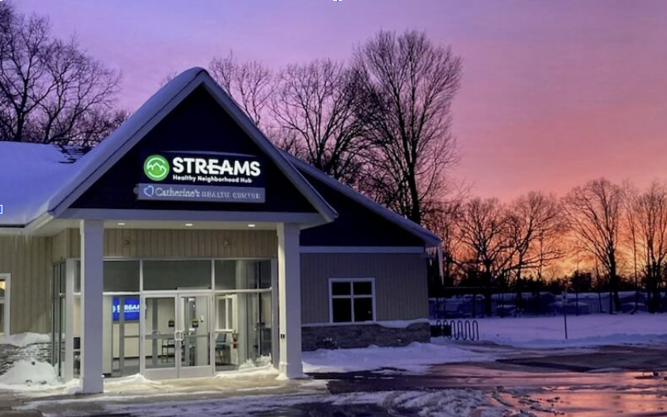

```{r}
#| label: setup
#| include: false

library(tidyverse)
library(ggformula)
library(ggforce)
library(ggeffects)
library(glmmTMB)

knitr::opts_chunk$set(
    echo = FALSE,
    message = FALSE,
    fig.width = 7,
    fig.height = 4
)
theme_set(theme_minimal(base_size = 20))
```

```{r}
#| include: false

health_survey_df <- read_csv("https://github.com/nghtctrl/proj-streams/raw/refs/heads/main/clean_health_survey_data.csv")
```
<div style="display: flex; align-items: center; justify-content: flex-start;">
  
  <h1 style="margin: 0; position: absolute; left: 50%; transform: translateX(-50%);">Catherine's Service Utilization</h1>
</div>
<div style="text-align: center;">
  <p>Jiho Kim, Minji Hur, Jake McClure, Sally Amonoo-Mensah, Stacy DeRuiter, Erica Boldenow, Dani McBride</p>
</div>

<!-- style notes... -->

<!-- we used the "lux" theme - see more at: -->

<!-- https://quarto.org/docs/output-formats/html-themes.html -->

```{=html}
<!-- consider more customization of colors, etc. - some options at
<!-- https://quarto.org/docs/output-formats/html-themes.html -->
```

<!-- or use css if you know how -->

::::::: grid
::: g-col-4
<!-- This column takes 1/3 of the page -->

### Introduction

- Our partner, Streams, is a Christian nonprofit in Grand Rapids, working with Catherine's Health Center to improve its utilization by people living in the Townline neighborhood.
- Our project uses data from a neighborhood health survey conduced by Calvin University nursing students, which includes self-reported information on healthcare access, barriers to care, physical health, income, demographics, and more.
- Our central question asks whether age is associated with receiving services at Catherine's Health Center; we initially considered income but shifted focus due to sample size limitations.
- This question matters because identifying who uses Catherine's services helps our partners target outreach and improve resource allocation.
- Prior work, such as Andersen healthcare utilization model (Andersen, 1995) and studies on socioeconomic barriers (Shi and Stevens, 2005), highlight the importance of considering demographic factors and socioeconomic barriers in healthcare utilization, informing our approach.

### Exploratory Data Analysis

```{r}
gf_bar(~received_services_at_catherines,
    fill = ~income_category,
    data = subset(health_survey_df, !is.na(income_category) &
        !is.na(received_services_at_catherines)),
    position = "dodge"
) +
    labs(
        title = "People Who Are More Affluent Tend Not to Use Catherine's Services.",
        x = "Income",
        y = "Count"
    ) +
    scale_fill_discrete(name = "Income Category") +
    theme_minimal()
```

:::

::: g-col-4
<!-- This column takes 1/3 of the page -->

```{r}
gf_boxplot(
    received_services_at_catherines ~ age,
    data = health_survey_df
) |> gf_labs(
    title = "Older People Receive More Services at Catherine's",
    x = "Age (years)",
    y = "Received Services at Catherine's"
) + theme_minimal()
```

### Statistical Modeling

- We fitted a binomial logistic regression model with a logit link function, using `Received Services at Catherine's?` as the binary response variable and `Age` as the key predictor.
- We focused on estimating the total effect of age without adding covariates, due to sample size limitations.

### Main Findings

- Model assumptions (i.e., logit-linearity, mean-variance relationship, independence of residuals) were checked and satisfied.
- The fitted model found a strong evidence of positive association between age and the probability of receiving services (p = 0.0015).
- Each additional year in age increases the probability of receiving services at Catherine's by about 0.0358 (95% CI: 0.0138 to 0.0578).
- Therefore, older individuals are more likely to have received services compared to younger individuals.

:::

:::: g-col-4
<!-- This column takes 1/3 of the page -->

```{r}
#| include: false

health_survey_df <- health_survey_df |>
    mutate(
        received_services_at_catherines = factor(
            received_services_at_catherines
        )
    )

health_survey_model <- glmmTMB(
    received_services_at_catherines ~ age,
    data = health_survey_df,
    family = binomial(link = "logit")
)
```

```{r}
age_preds <- ggpredict(health_survey_model, terms = c("age"))
plot(age_preds) +
    labs(
        title = "Predicted Probability of Receiving Services at Catherine's",
        x = "Age (years)",
        y = "Predicted Probability"
    ) +
    theme_minimal()
```

### Our Experience

- Balancing a small sample size with the desire for a complex model was challenging. One positive outcome is that we can inform our partner that more data is needed to support more complex models.
- Despite technical challenges, working on this project allowed us to live out our value of service by using data analysis to help Catherine's Health Center better serve its neighbors.

### Acknowledgements

- We would like to thank Streams service utilizers and Townline neighborhood residents for their participation in the health surveys. We also thank Streams staff and community volunteers as well as the Calvin Public Health and Nursing Departments for their logistical and financial support.

### Works Cited

::: {style="font-size: 70%;"}
Andersen, Ronald M. “Revisiting the Behavioral Model and Access to Medical Care: Does It Matter?” Journal of Health and Social Behavior, vol. 36, no. 1, 1995, pp. 1–10. JSTOR, https://doi.org/10.2307/2137284.
:::

::: {style="font-size: 70%;"}
Shi, Leiyu, and Gregory D Stevens. “Vulnerability and unmet health care needs. The influence of multiple risk factors.” Journal of general internal medicine vol. 20,2 (2005): 148-54. doi:10.1111/j.1525-1497.2005.40136.x
:::

::::
:::::::
